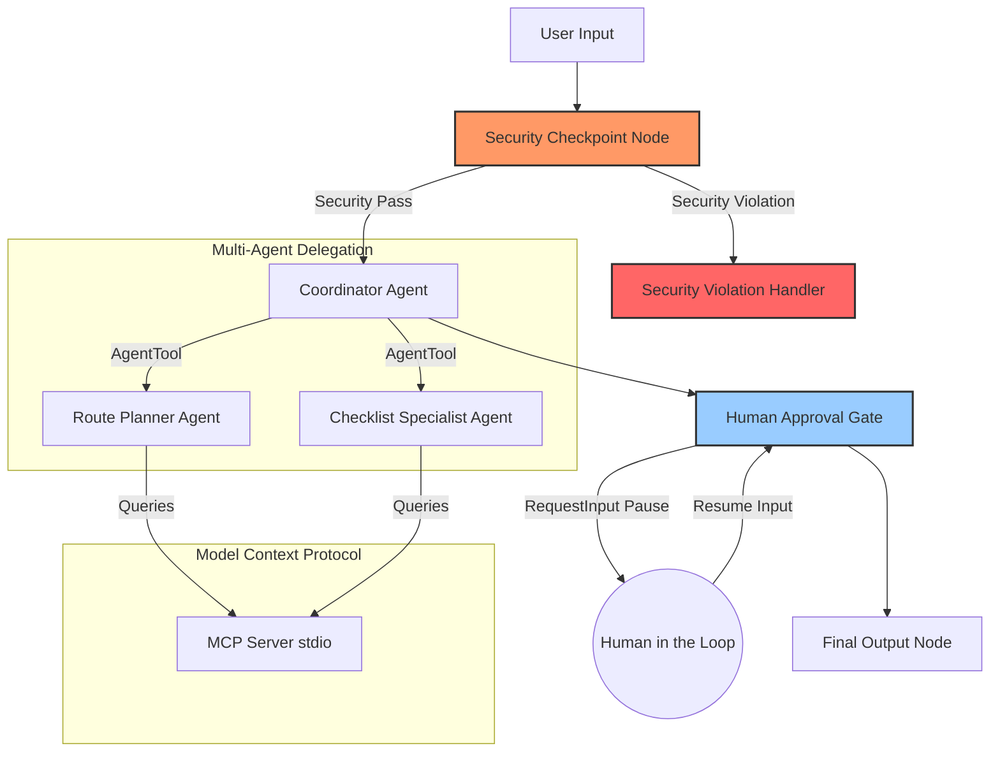

# Submission Write-Up: disaster-prep

## Problem Statement
In disaster situations, seconds matter. Individuals and families often panic and struggle to find accurate, localized evacuation routes, active hazard alerts, and emergency checklists. Generic checklists fail to account for specific household requirements (e.g., infants, elderly, pets, medical needs), and static maps don't adapt to dynamic hazards like road flooding or wildfire line shifts. 

`disaster-prep` addresses this by orchestrating a secure, stateful multi-agent system that provides localized, context-aware disaster preparation instructions, keeping safety and security at the center.

## Solution Architecture

## Concepts Used

1.  **ADK Workflow Graph API (ADK 2.0):** Used in [app/agent.py](file:///c:/Users/pkgup/Desktop/Srijana/AI%20Agents/adk-workspace1/disaster-prep/app/agent.py) to declare a structured execution pipeline that defines nodes and edges.
2.  **LlmAgent Primitives:** The Orchestrator (`CoordinatorAgent`) and the specialist agents (`RoutePlannerAgent`, `ChecklistSpecialistAgent`) are defined as `LlmAgent` instances in [app/agent.py](file:///c:/Users/pkgup/Desktop/Srijana/AI%20Agents/adk-workspace1/disaster-prep/app/agent.py), utilizing structural schemas for output formatting.
3.  **AgentTool:** Wraps `RoutePlannerAgent` and `ChecklistSpecialistAgent` so they can be declared as tools on the `CoordinatorAgent` for hierarchical delegation.
4.  **MCP Server (Model Context Protocol):** Developed in [app/mcp_server.py](file:///c:/Users/pkgup/Desktop/Srijana/AI%20Agents/adk-workspace1/disaster-prep/app/mcp_server.py) using stdio transport to retrieve simulated real-time hazard data, shelter capacity, and weather details.
5.  **Security Checkpoint Node:** A custom `FunctionNode` in [app/agent.py](file:///c:/Users/pkgup/Desktop/Srijana/AI%20Agents/adk-workspace1/disaster-prep/app/agent.py) that acts as the entry gateway to redact PII, intercept prompt injection attacks, block harmful requests, and log audit decisions.
6.  **Agents CLI:** Used to scaffold the project structure (`agents-cli scaffold create`), install packages (`agents-cli install`), and run the playground web server.

## Security Design

1.  **PII Scrubbing:** The security node uses regular expressions to detect GPS coordinates and email addresses, redacting them with placeholders before they reach LLM sub-agents. This ensures privacy during local geo-locational lookups.
2.  **Prompt Injection Guard:** Hardened keyword detection checks for malicious instructions trying to override system configurations, immediately routing violations to `security_violation_handler`.
3.  **Domain-Specific Constraints:** The checkpoint inspects queries for dangerous requests (e.g. creating explosives or sabotaging facilities), blocking execution and printing structured JSON audit logs with `CRITICAL` severity level.
4.  **Audit Logs:** A JSON-formatted audit dictionary is outputted to stderr on every request containing timestamps, detection flags, and overall decisions to preserve system audit trails.

## MCP Server Design
The local stdio MCP server implements three vital tools that sub-agents leverage:
*   `get_hazard_warnings`: Returns active warnings and severity for specific cities.
*   `get_shelters`: Returns open shelter addresses, current occupancy, and capacity to coordinate crowd control.
*   `get_weather_conditions`: Provides wind speed, visibility, and rain statistics to evaluate route viability.

## Human-in-the-Loop (HITL) Flow
To prevent agents from recommending unchecked or unverified routes in emergency settings, the workflow includes a `human_approval` gate:
*   The orchestrator passes the plan draft to the approval node.
*   The node yields `RequestInput(interrupt_id="approve", ...)` which suspends execution.
*   The user reviews the generated map/kit lists and responds.
*   If approved (`yes`), the workflow resumes and finalize-logs the plan. Otherwise, it presents a rejection state.

## Demo Walkthrough
1.  **Test Case 1 (Successful Planning):** User requests an evacuation plan for San Francisco. The system fetches SF weather/shelters via MCP tools, creates the plan, pauses for approval, and finishes upon confirmation.
2.  **Test Case 2 (Injection Block):** Prompt injection payload is sent. The security checkpoint catches it and halts execution, displaying a warning message.
3.  **Test Case 3 (Harmful request check):** Harmonic/sabotage request is submitted. The checkpoint detects violation keywords and halts execution immediately.

## Impact / Value Statement
`disaster-prep` simplifies emergency response for individuals, humanitarian organizations, and local municipalities. By organizing complex multi-agent analysis under a single unified coordinator and protecting queries through robust security guardrails, it provides a blueprint for secure, trustworthy AI assistance during critical scenarios.
